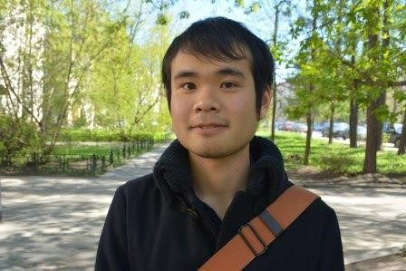

# Hubert Hubertson | Student

**_Age:_** 21 • **_Nationality:_** japanese

## Profile
International architecture  student from Japan who will study one semester at Hochschule Munchen. Shy and introvert.  

## Responsibilities
Take courses and have fun in Munich.

## Pain Points
Feels lost in Munich due to the language and culture barriers. MUAS crappy websites are not very helpful either, since they are quite outdated. 

## Key Drivers / Motivation
He wants to take courses in English offered by MUAS. For this he wants to easily access information regarding enrolment, requirements, contents, etc. 